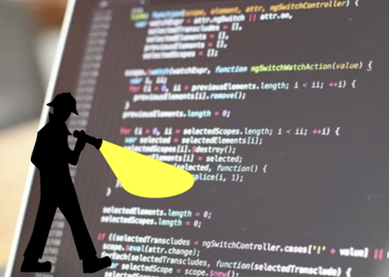
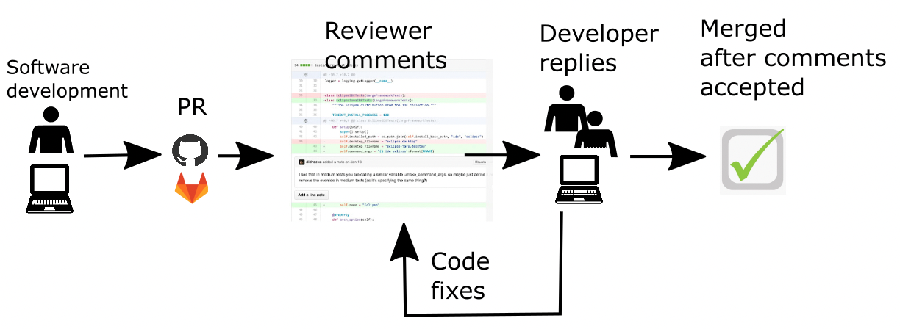
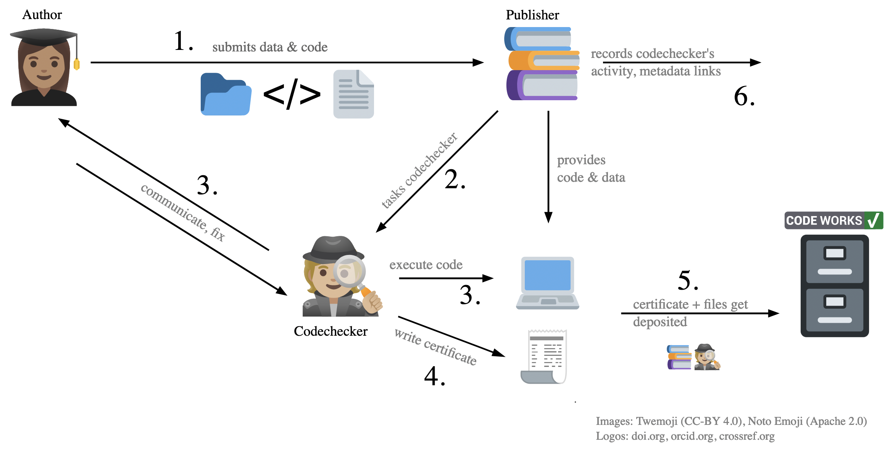
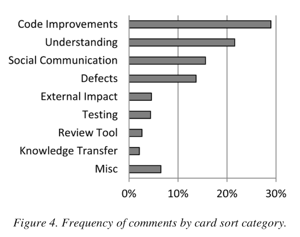

### Part 1

<h3>What is a code review?</h3>



### Code review?

Main benefits:

(1) Catching bugs

(2) Ensuring quality standard

(3) Spreading knowledge

(4) Training new developers


::: notes

-   Viewed as an important practice in the software industry.
-   Key step in contributing to most software projects (gatekeeping).

:::

### From formal inspections to code review


### Asynchronious Code Review



### Not a peer review for code

-   Code review **throughout the research process**:
    -   Frequent
    -   Informal
    -   Low stakes
-   Commonly referred as "Modern Code Review" in the SE litterature.
    Bachelli and Bird 2013
-   Can be asynchronous (GitHub's Pull Requests) or synchronous (in
    person chat).

### CODECHECK



### Two contexts

1.  Individual developers writing their own specific software.
2.  Developers collaboration on a common codebase.
    -   Code review as gatekeeping.

### Research on code reviews

*Modern Code Review: A Case Study at Google* (Sadowski, 2018)

*Expectations, Outcomes, and Challenges of Modern Code Review*
(Bacchelli and Bird, 2013)

*Code Reviewing in the Trenches: Understanding Challenges and Best
Practices* (McLeod et al, 2017)

*Code review by and for scientists* (Petre & Wilson, 2014)

### Part 2

Benefits of code reviews for research software

### Code review for software quality

1.  Defects
2.  Code improvements


::: notes

If you ask Microsoft developers about why they are doing code reviews,
you'll find that the main motivation is making the code better. This
means identifying defects and improving the code.

Code improvements are changes that do not affect the functionalities
but make the code more readable or maintainable. You can think of
complying to a naming scheme, identifying code smells.

:::

### Code review for software quality



::: notes

In practice, defects aren't the first thing that code review really
help with. It can help, but maybe testing is a better investement in
order to prevent bugs.

But code review is clearly effective for improving code.

:::

### Code reviews for understandability

More often than not source code is the only available form of documentation.

Understandability is key for **code reuse** and **transparency**.

::: notes

Understanbility goes beyond readability, it measures how easy it is to get
comfortable making changes to a software system. Understandability is a prime
quality for research software.

If you think of a research group in which researchers write their own bespoke
programs for their specific data manipulation or computational experiement,
these will not be documented.

Code review is a good assessment of understandability and this makes
it very attractive for research software.

:::

### Code reviews for team awareness

-   Continuous knowledge exchange.
-   Enhanced collaboration.
-   Longer term resilience of project(s) (Bus factor!).

::: notes

Code review goes beyond understability. Esp important in research where
developers may be more isolated from each other and it's easy to struggle and
come up with your own bespoke solutions.

I can tell you the sotry of what is happening currently at Imperial.
- Handful of PhD students, all training ML models
- Need to read in and manage many different parameters
- Through code review became obvious they are all trying to do similar thing.
- Working together to come up with a shared solution.
- Common, standardized way of dealing with model parameters that they all
  understand. They will benefit from that over the course of their PhD.

Code review had an indicrect impact: people talk to each other more.

:::

### Code reviews for knowledge transfer

Code review is peer learning.

- Spread of good practices.
- Homogeneisation of styles and practices

. . .

```
filepath = "/my/own/specific/path/" + "data.csv"
```

. . .

```
from pathlib import Path
# ...
filepath = datadir_path / Path(datafile)
```

::: notes

If the Bachelli sutdy was carried out in a lab, knowledge transfer would be
huge. Because knowledge is very unenvely distributed in research.

Use of a yaml input file
Dataclasses

:::

### Code review is challenging

A lot of good practices around...

...but what about **research software**?

::: notes

The elephant in the room: nobody does code review.  Some may do it as part of
collaborating on a distributed project.

Generally within a research group or a lab/department, for the reasons above
this is not happening.

:::

### Code review is time and energy

Two complementary courses of actions:

::: incremental

-   Regularly reflect process and follow good practices.
-   Acknowledge code review as a worthy investement:
    -   "middle-term" benefits for individuals.
    -   Short and long term benefits for collectives.

:::

. . .

**Large return on investment**

::: notes

It's a fact but both time and energy investement can be reduced.

One prerequisite of code reivew is being okay with somebody looking
your code.

:::

### Being protective about code

1. There can be some unhealthy competition going on.
2. A large number of researchers feel shy about their coding practices:

-   Lack of training.
-   Other priorities, often structural (e.g. funding).
-   Why would I share my code if nobody else does?

. . .

Code review can put software (back?) at the heart of the collaborative
scientific process.

::: notes

shame is perhaps the biggest issue. From my modest 5 years exp as a full time
RSE, I've worked with researchers in various and often feel ashamed of their
coding practice. Several factors: lack of training, code is an afterthought,
not used to share code. Code review can help turn the tide.

:::

### Strong heterogeneity among team members

-   Experience.
-   Skills (*e.g.* programming languages).
-   Interest & motivation.

::: notes

Code review litterature reports on the effect of heterogeneity among
participants who can be very junior developers up to employees with more than
10 years experience int he software industry or even the same company. They
share common skill base, vocabulary, interest in SE.

But in research this is a whole other level of heterogeneity.

:::

### Finding reviewers

What about "lone coders"?

### Bad experiences

Code review can lead both to inclusion and exclusion.

Dual nature: both **technical** and **social** practice.

### Bad experiences

-   Irrelevant feedback.
-   Petty arguments decoupled from overall scientific goal.
-   Power struggles.

These must be and active effort to keep these under control. Similar
to technical debt.

. . .

> A bad reviewer tries to force their preference on you. A good code
> reviewer makes your code confrom to certain principles, but not
> opinion. (*Quote from survey participant from Greiler, 2016*)

### Lack of guidelines

https://dev-review.readthedocs.io/

https://osc-delft.github.io/posts/2021/09/03/Research-Code-Review/

https://www.djmannion.net/code_review/

https://blog.hpc.qmul.ac.uk/code_review_whri.html

### Part 3

<h3>Code reviews done right</h3>

### Code review good practices

A lot of the good practices from software engineering industry are applicable,
**with a pinch of salt**.

::: notes

The following results from combination of industry good practice and
observations/experimentation in a research context.

:::

### Short meetings

3 times 30' instead of one time 90'

-   Fit in a busy schedule.
-   Doesn't feel like a big commitment.
-   Code review can be a very demanding activity.

Remember that software isn't the primary driver.

### Engage with the review

Avoid "comfort mode" at all costs!

-   Author describes goes through code as if logic and implementation is
    obvious.
-   Reviewers assume author "know what they are doing".

. . .

- Reviewers should **never stop questionning** and trying to understand the code
- Authors should **give reviewers opportunities to interject**.

### The author's part

-   Choose a small piece of code.
-   Provide a description of the purpose and structure of the code.
-   Think ahead what reviewers will and will not be familiar with
    -   Specific libraries?
    -   Specific domain knowledge?
-   Ensure minimum quality standard (*e.g.* style, naming)

Put yourself into your reviewer(s)' shoes: what would you want to be
told if asked to review your code?

::: notes

A code review's success partly rests on the author's shoulder.  Authors are not
entirely responsible for the review success, but can definetely make it fail.

:::


### Let authors specify the feedback they are after

*I'm not happy with this loop*

```
    for i in `seq 1 $NUMOFFIG`
    do
        FIG=$(ls $IMDIR | head -n $i | tail -n 1)
        echo "    ${placeholderpath}/${FIG}" >> $FILE
    done
```

. . .

*I'm having to define a lot of classes that don't do much, what do you
think of my design?*

. . .

*I don't have any specific issue in mind, but I'm curious to see
whether or not you find it hard to to follow the code's logic.*

::: notes

Feedback is likely to be more targeted and impactful.

:::

### Define (and enforce) a scope

Example default scope: understandability

-   Poor formatting.
-   Obscure variable names.
-   Complex conditionals.
-   Long functions.
-   Long parameter lists.
-   ~~Design red flags~~.
-   ~~Performance sinks~~.
-   ~~Security concerns~~.

Default scope can be overrriden at will.

::: notes

Another way to foster relevant feedback and discussions is to define a scope.

:::

### Whether "it works" or not is irrelevant

- Code review is not an evaluation of a finished product.
- It is more rewarding to look at code that is WIP.
- The only expectation is that code is readable by reviewers.

::: notes

-   Formatting, dead code, comments...

:::


### Make it formal -- but safe

Code review is more effective with a clear process (formal)

*At the same time,*
Code review meetings *must* remain inclusives and supporting spaces.

**It's about creating an environment where people feel confident about
discussing their code to each other.**

### Overheard in the next meeting room

Author: *This loop I wrote looks too complicated to me.*

. . .

Reviewer: *Hmmm yes. You could just use a pipe and `xargs`.*

. . .

Author: *What's `xargs`?*

. . .

Reviewer: *It's basically mapping a command over a set of inputs - think
functional programming!*

. . .

Author: *&#x2026;*

. . .

Reviewer: *Alhtough you could also do the same thing with `sed`.*

. . .

Author (looking frustrated): *I have no idea what you're talking about.*

### All feedback isn't helpful

...at least for now.

Reviewers with more programming experience/enthusiasm must be
careful not to overwhelm beginners.

### Use a checklist

-   [ ] Poor formatting.
-   [ ] Dead code.
-   [ ] Missing documentation.
-   [ ] Obscure names.
-   [ ] Complex conditionals.
-   [ ] Obscure one-liners.
-   [ ] Duplicated code.
-   [ ] Long procedures.
-   [ ] Long parameter lists.
-   [ ] Global state.
-   [ ] Abuse of primitive types.
-   [ ] Data clumps.
-   ...

::: notes

Give an opportunity for beginners to participate.

Start with the easy checks.

:::

### Critique the code, not the programmer

*You clearly made little effort in naming things&#x2026;*

*You should name this differently*

*I think this name is misleading*

:::

Feedback can be hard to stomach

:::

### Giving feedback is not trivial

1.  Own you opinions.
2.  Make it about the code.
3.  Be specific.
4.  Suggest an alternative.

. . .

*I think this function's purpose would be much clearer if it was given
a more explicit name.. perhaps `apply_bwd_transform`?*

### Define (and refine) a policy

-   Well defined process.
-   Default scope.
-   Moderator(s).
-   Code of conduct.
-   Conflict resolution.

### A culture of openess and collaboration

- Components of a successful software project are
  + Code
  + People
  + Communication
- Research code review goes along with collective ownersip of research project.

::: notes

:::
